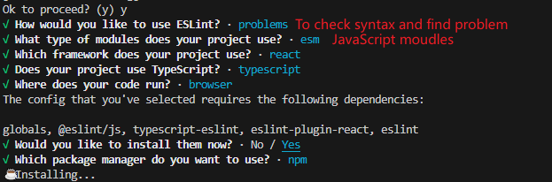
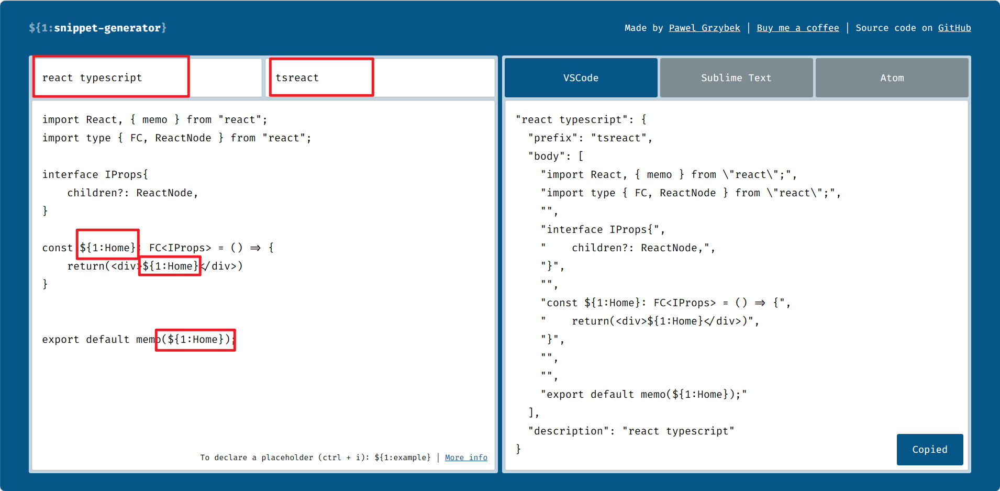
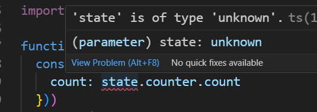
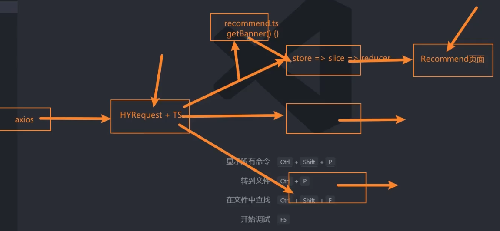
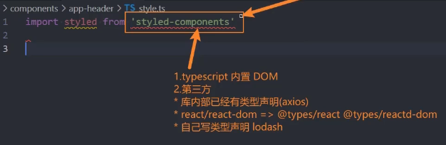
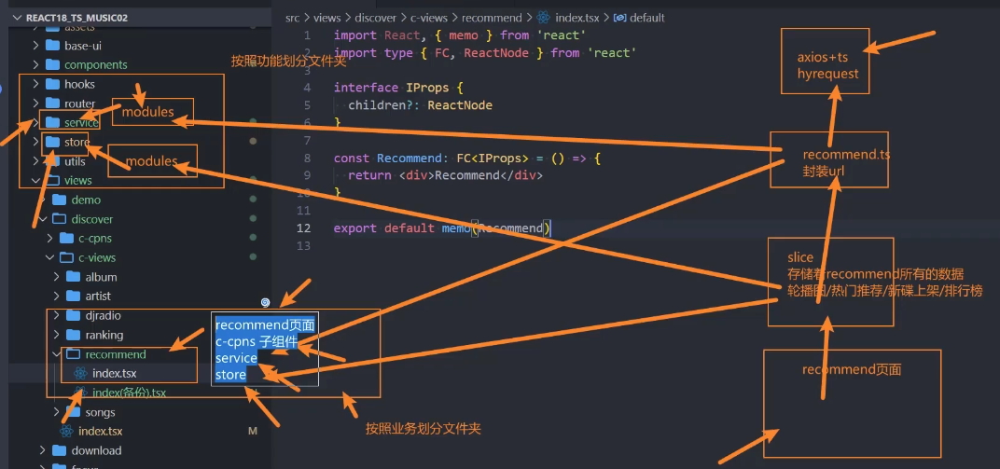

# Day01

### 配置editorconfig和prettier

#### 配置editorconfig

在根目录下新建.editorconfig文件

```python
# http://editorconfig.org

root = true

# Unix-style newlines with a newline ending every file
[*] # 表示所有文件适配
charset = utf-8 # 设置文件字符集
indent_style = space # 缩进风格 [tab | space]
indent_size = 2 # 缩进大小
end_of_line = lf # 控制换行类型
trim_trailing_whitspace = true # 去除行尾的任意空白字符
insert_final_newline = true # 始终在文末插入一个新行

[*.md] # 以下只对.md文件生效
max_line_length = off
trim_trailing_whitspace = false
```

#### 配置prettier

- 安装prettier插件
  ```shell
  npm install prettier -D
  ```
- 配置格式化
  在根目录下新建.prettierrc.json文件，rc代表运行时执行
  ```json
  {
    "useTabs": false,
    "tabWidth": 2,
    "printWidth": 80,
    "singleQuote": true,
    "trailingComma": "none",
    "semi": false
  }
  ```
- 配置忽略目录
  在根目录下新建.prettierignore文件，设置格式化时忽略的文件

  ```json
  /build/*
  .local
  .output.js
  /node_moudles/**

  **/*.svg
  **/*.sh

  /public/*
  ```

- 设置格式化命令
  在package.json的scripts属性下增加
  ```json
  "scripts": {
    "start": "craco start",
    "build": "craco build",
    "test": "craco test",
    "eject": "react-scripts eject",
    "prettier": "prettier --write ."
  },
  ```
  命令行中的使用命令
  ```shell
  npm run prettier
  ```
- 使用VScode中Prettier-Code formatter插件
  安装Prettier-Code formatter插件后，在Settings => 搜索default => Editor: Default Formatter => 选择Prettier-Code formatter

#### 搭建ESLint环境

- 安装eslint插件
  ```shell
  npm install eslint -D
  npm install eslint-plugin-prettier eslint-config-prettier -D
  ```
- 初始化eslint
  ```shell
  npx eslint --init
  ```
  
- 配置eslint，主要是node环境和忽略的规则

### CSS重置和引入less

- CSS重置
  ```shell
  npm install normalize.css
  ```
  在index.tsx中直接引入`import 'normalize.css'`即可
- 引入less
  [在antd教程中查看](https://4x-ant-design.antgroup.com/docs/react/use-with-create-react-app-cn#header)
  安装版本改为`npm install craco-less@2.1.0-alpha.0`
  然后在`.craro.config.js`中增加
  ```js
  plugins:[
    {plugin: CracoLessPlugin}
  ],
  ```
- 初始化CSS重置文件
  在assest下新建css文件夹，新建index.less作为出口文件、reset.less和commom.lsee作为重置css文件

  ```less
  '''reset.less''' blockquote,body,button,dd,dl,dt,fieldset,form,h1,h2,h3,h4,h5,h6,hr,input,legend,li,ol,p,pre,td,textarea,th,ul{
    // color: @mainColor;
    padding: 0;
    margin: 0;
  }

  a {
    color: #333;
    text-decoration: none;
  }

  img {
    vertical-align: top;
  }
  ```

  ```less
  '''common.less''' #app {
    width: 100%;
    height: 100%;
  }
  ```

  ```less
  '''index.less'''
  @import "./reset.less";
  @import "./common.less";
  ```

### 配置路由

#### 安装路由插件

```shell
npm install react-router-dom
```

在router文件夹下新建index.tsx文件用来配置路由
在views文件夹下新建组件
注意要将App组件用HashRouter或者BrowserRouter包裹起来

### 规范化组件编写：限制props属性+memo缓存组件

#### 限制props属性：两种方式

- 在限制组件属性时规定
  ```tsx
  // 注意引入ReactNode的方式，对于这类属性的引入，加入type关键词以优化编译
  import type { ReactNode } from 'react'
  // 或者import type { FC, ReactNode } from "react";对应到下面React.FC只写FC即可
  interface IProps {
    children?: ReactNode // 后面带?的是可选属性
    name: string
    age: number
    height?: number
  }
  const Download: React.FC<IProps> = (props) => {
    return <div></div>
  }
  // 此种方式下规定默认属性会给予提示
  // 因为此时编辑器知道Download是个React的函数
  Download.defaultProps = {
    name: '222',
    age: 20
  }
  ```
- 直接规定
  ```tsx
  const Download = (props: IProps) => {
    return <div></div>
  }
  ```

#### 使用memo包裹

```tsx
import React, { memo } from "react";
......
export default memo(Download);
```

#### 配置模板文件

[转化的网址](https://snippet-generator.app)
配置路径：File => Preferences => Configure User Snippets => typescriptreact 末尾复制即可


# Day02

## 组件懒加载

在路由配置文件中，直接import多个组件是放在同一个包里的，当资源比较大时会很耗时，因此做一个分包处理，也就是组件的懒加载，使用React.lazy函数导入组件
同时，对useRoutes部分用Suspense组件进行包裹，这样资源没下载时可以设置一个loading...的等待内容。

```tsx
'''/router/index.tsx'''
const Discover = React.lazy(() => import('@/views/discover'));
```

```tsx
'''App.txs'''
<Suspense fallback="">{useRoutes(routes)}</Suspense>
```
## 二级路由配置
### 添加路由
在二级路由的父级路由中添加children属性
```tsx
  {
    path: '/discover',
    element: <Discover />,
    children:[
      {
        path:'/discover',
        element:<Navigate to="/discover/recommend" />
      },
      {
        path:'/discover/recommend',
        element:<Recommend />
      },
      {
        path:'/discover/ranking',
        element:<Ranking />
      }......
    ]
  },
```
### 配置二级路由的Suspence
在二级路由展示信息的界面div外套一层Suspence组件，防止闪烁，其中Outlet组件是路由信息的占位组件
```tsx
<Suspense fallback="">
  <Outlet />
</Suspense>
```

# Day03
## 利用reducejs/toolkit工具使用redux
### 创建store
在其中集成管理所有的module片段
```ts
'''./store/index.ts'''
import { configureStore } from "@reduxjs/toolkit";
import counterSlice from "./modules/counter";
import { TypedUseSelectorHook, useSelector } from "react-redux";

const store = configureStore({
    reducer: {
        counter: counterSlice
    }
})

export default store;
```
### 使用store -> 使用Provider包裹要使用的组件
```ts
'''./index.tsx'''
root.render(
  <Provider store={store}>
    <HashRouter>
      <App />
    </HashRouter>
  </Provider>
)
```
### 创建对应的module 创建对应的片段
```ts
'''./store/modules/counter.ts'''
import { createSlice } from "@reduxjs/toolkit";

const counterSlice = createSlice({
    name:'counter',
    initialState:{
        count:100,
        message:"Hello Redux"
    },
    reducers:{}
})

export default counterSlice.reducer;
```
### 使用创建的Slice片段
例如在App.tsx里使用
+ 引入Slice片段
  ```tsx
  const { count, message } = useAppSelector(
    (state) => ({
      count: state.counter.count,
      message: state.counter.message
    }),
    shallowEqual
  )
  ```
  此时对象体内state会报类型为unknown的错误，解决方法就是规定state的类型，我们当然可以使用interface去定义一个接口去限制，但这样我们每次修改counter就要修改这接口，因此希望通过一种自动的方式获取state的类型
  *对于unknown类型的变量，不能进行操作*
  
+ 返回第一步创建store时封装useAppSelector
  https://cn.redux.js.org/tutorials/typescript-quick-start
  
  创建useAppSelector的hooks同时对传入的state类型做限制
  ```ts
  '''./store/index.ts'''
  import { configureStore } from "@reduxjs/toolkit";
  import counterSlice from "./modules/counter";
  import { TypedUseSelectorHook, useSelector } from "react-redux";

  const store = configureStore({
      reducer: {
          counter: counterSlice
      }
  })

  type GetStateFnType = typeof store.getState;
  export type IRootState = ReturnType<GetStateFnType>

  // useAppSelector的hook
  export const useAppSelector: TypedUseSelectorHook<IRootState> = useSelector;

  export default store;
  ```
  `store.getState`能够拿到store返回值的类型
  `export type IRootState = ReturnType<GetStateFnType>`相当于
  ```ts
  interface IRootState {
    count:Number,
    message:String
  }
  ```
### 修改数据
+ 基础版本
  1. 在counter.ts中创建数据的相应修改Action
   ```ts
    '''./store/modules/counter.ts'''
    import { createSlice } from '@reduxjs/toolkit'

    const counterSlice = createSlice({
      name: 'counter',
      initialState: {
        count: 100,
        message: 'Hello Redux'
      },
      reducers: {
        // 此处创建变量的action修改函数
        changeMessageAction(state, { payload }) {
          state.message = payload
        }
      }
    })

    // 使用counterSlice.actions对修改函数进行暴露
    export const { changeMessageAction } = counterSlice.actions
    export default counterSlice.reducer

   ```
  2. 在App.tsx中创建按钮的调用函数，拿到Action后进行调用
   ```tsx
    '''./App.tsx'''
    const dispatch = useDispatch();
    function handleChangeMessage(){
      dispatch(changeMessageAction('hhhhhhh'));
    }
   ```
+ 抽离useDispatch函数和shallowEqual
  在./store/index.ts中对两个函数进行抽离，主要是为了方便管理，关键点还是在于抽离useSelector函数
  ```ts
  type GetStateFnType = typeof store.getState
  type IRootState = ReturnType<GetStateFnType>
  type DispatchType = typeof store.dispatch

  // useAppSelector的hook
  export const useAppSelector: TypedUseSelectorHook<IRootState> = useSelector

  export const useAppDispatch: () => DispatchType = useDispatch

  export const shallowEqualApp = shallowEqual;
  ```
# Day04
## TS函数签名
函数签名：限制传入参数类型和返回值类型，使用interface进行定义
范式：函数签名中可以当作一个传入参数使用的东西，利用<>声明，同时可以进行类型推断
```ts
interface IFnCall<IRoot> {
    // <泛型>(参数名称:参数类型...):返回值类型
    <TWhy>(fn: (num: IRoot) => TWhy, age: number) : TWhy
}

// 定义函数对象
// 函数名称:签名<泛型>=function(参数){函数体}
const foo: IFnCall<number> = function (fn, age){
    return fn(111);
}
// 调用函数
foo<string>(() => {
    return 'aaa'
}, 18)
// 不传入明确的调用时的泛型，类型推断
const res = foo((aaa) => {
    return 'aaa'
}, 18)
```
## axios封装

## 区分工作环境
```ts
'''./serve/config/index.ts'''
// 依赖当前的环境自动切换生产环境和开发环境
// console.log(process.env.NODE_ENV) // 输出当前工作环境
let BASE_URL = '';
if(process.env.NODE_ENV === 'development'){
    BASE_URL = 'http://codercba.com:9002';
} else {
    BASE_URL = 'http://codercba.com:9002';
}

export { BASE_URL }
```



#### 业务组织文件划分



# 切换歌曲的功能
维护一个playSongList和playSongIndex，记录播放列表和当前播放的歌曲id
维护时分两种情况：
+ playSongList中有该歌曲，直接从其中获取歌曲信息，并修改playSongIndex
+ 无当前歌曲，发送请求获取歌曲信息，push到播放列表，修改playSongIndex
 